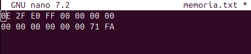
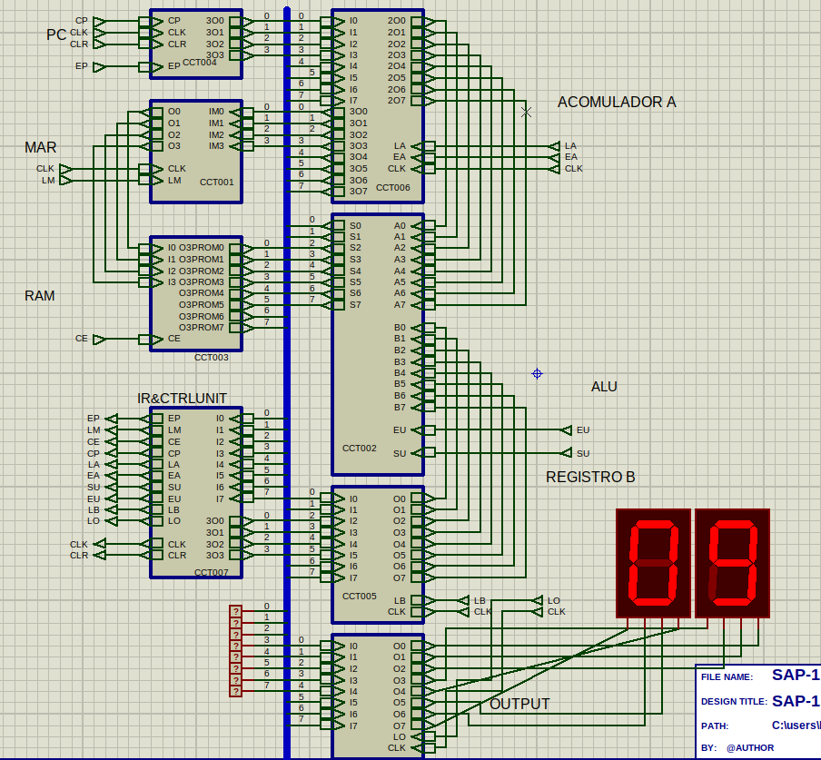
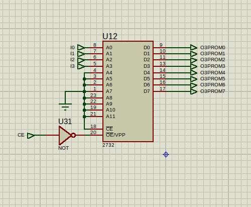
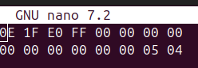
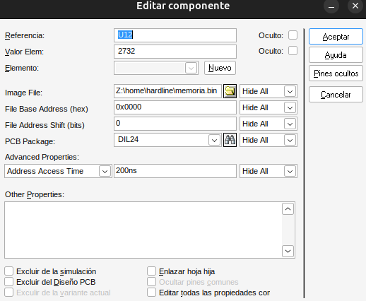
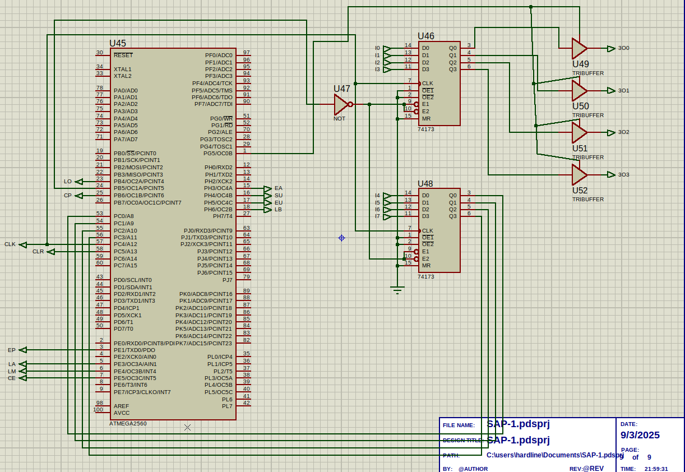
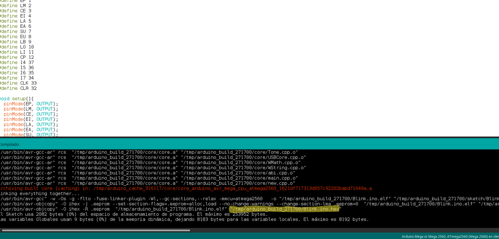

# SAP-1 (Simple As Possible 1)

El SAP-1 (Simple As Possible 1) es un modelo educativo de computadora diseñado para enseñar los conceptos básicos de la arquitectura de computadoras y la programación a nivel de hardware. Este modelo es una simplificación extrema de una computadora real, pero incluye todos los componentes esenciales para entender cómo funciona una computadora.

## Componentes Principales

- **Unidad de Control (Control Unit)**: Dirige las operaciones del procesador.
- **Contador de Programa (Program Counter)**: Mantiene la dirección de la siguiente instrucción a ejecutar.
- **Memoria (Memory)**: Almacena instrucciones y datos.
- **Registro de Instrucción (Instruction Register)**: Almacena la instrucción actual que se está ejecutando.
- **Registro de Dirección de Memoria (Memory Address Register)**: Almacena la dirección de la memoria que se está accediendo.
- **Registro de Datos de Memoria (Memory Data Register)**: Almacena los datos que se están leyendo o escribiendo en la memoria.
- **Acumulador (Accumulator)**: Almacena los resultados de las operaciones aritméticas y lógicas.
- **Unidad Aritmética y Lógica (Arithmetic Logic Unit, ALU)**: Realiza operaciones aritméticas y lógicas.
- **Bus**: Sistema de comunicación que transfiere datos entre los componentes.

## Funcionamiento general(Como programarlo)

En memoria se alamacenan las instrucciones y los valores, se ve algo tal que asi,


Cada par de numeros representa un byte en hexadecimal, se tiene una memoria de 16 bytes, cada byte puede ser una instruccion o un numero, por ejemplo en este ejemplo el primer byte (arriba-derecha) ***0E*** es una instruccion, donde ***0*** indica la instruccion ***LDA*** y ***E*** indica la posicion de memoria donde esta el numero que tiene que cargar en el acomulador A. Hay 16 posiciones de memoria y por ejemplo la ***E*** es la posicion 15 y adentro tiene el numero en *71* en hexadecimal que en decimal es *113*, este SAP hace la siguiente operacion ***A = A + B*** o ***A = A - B*** donde los posibles valores del resultado son ***-255 < A < 255***, para numero negativos el hexadecimal resultante debe ser pasado a un binaro y este representa el ***complemento a dos***.

### Set Up

Este es proyecto de proteus:  

(SAP-1.pdsprj)

En al hoja hija de la "RAM" encontraremos un 2732 al cual hay que cargarle un binario, que contiene el programa 


Para esto se puede crear un .txt, en mi caso, memoria.txt que tenga la siguiente estructura, 


Este txt contiene el programa para saber como estan definidas las instrucciones [ver](#operaciones-del-SAP-1)

El comando que permite convertir este .txt con formato hexadecimal en un binario que es combatible con la "RAM
es:
```xxd -r -p memoria.txt memoria.bin``` 

Cargas este archivo `memoria.bin` en la opción `image file` de aqui 
 

Despues vas el hoja hija del `Instruction Register & Control Unit` y vas a ver esto:


Tienes que compilar el codigo de arduino que esta en el repositorio, y buscar donde quedo el .ino.hex para despues cargarlo en el arduino.


Haces doble click en el *ATMEGA2560* y en la opcion `program file` cargas la ruta del paso anterior.


## Operaciones del SAP-1

### Instrucciones

1. **LDA (Load Accumulator)**: Carga un valor desde una posición de memoria específica en el acumulador.
    - Código de operación: `0x0`
    - Ejemplo: `0E` (Carga el valor de la posición de memoria `E` en el acumulador)

2. **ADD (Add)**: Suma el valor de una posición de memoria específica al valor actual del acumulador.
    - Código de operación: `0x1`
    - Ejemplo: `1E` (Suma el valor de la posición de memoria `E` al acumulador)

3. **SUB (Subtract)**: Resta el valor de una posición de memoria específica del valor actual del acumulador.
    - Código de operación: `0x2`
    - Ejemplo: `2E` (Resta el valor de la posición de memoria `E` del acumulador)

4. **OUT (Output)**: Envía el valor actual del acumulador a la salida.
    - Código de operación: `0xE`
    - Ejemplo: `E0` (Envía el valor del acumulador a la salida)

5. **HLT (Halt)**: Detiene la ejecución del programa.
    - Código de operación: `0xF`
    - Ejemplo: `F0` (Detiene la ejecución)

### Ejemplo de Programa

A continuación se muestra un ejemplo de un programa simple para el SAP-1 que carga un valor en el acumulador, suma otro valor y luego envía el resultado a la salida:

```
0E  ; LDA E (Carga el valor de la posición de memoria E en el acumulador)
1F  ; ADD F (Suma el valor de la posición de memoria F al acumulador)
E0  ; OUT (Envía el valor del acumulador a la salida)
F0  ; HLT (Detiene la ejecución)
```

En este ejemplo, el programa realiza las siguientes operaciones:
1. Carga el valor de la posición de memoria `E` en el acumulador.
2. Suma el valor de la posición de memoria `F` al acumulador.
3. Envía el valor del acumulador a la salida.
4. Detiene la ejecución del programa.

Estas operaciones básicas permiten entender cómo funciona el procesamiento de instrucciones en el SAP-1 y cómo se pueden combinar para realizar tareas más complejas.

### Recordar que primero van las instrucciones y que las variables pueden ser leidas como instrcciones lo cual puede entorpecer la ejecucion del programa, para esto despues de las instrucciones usar HLT.